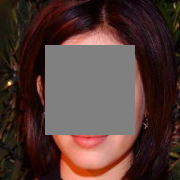
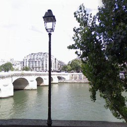

# GRIG: Data-efficient generative residual image inpainting
Official PyTorch implementation of GRIG.

[[Homepage]](https://longlongaaago.github.io/GRIG_few_shot_inpainting/)
[[paper]](https://arxiv.org/abs/2304.12035)
[[demo_youtube]](https://www.youtube.com/watch?v=czB3VAwhB0o)
[[demo_bilibili]](https://player.bilibili.com/player.html?aid=358757940&bvid=BV13X4y1n7T8&cid=1206882830&p=1)

<div style="text-align: justify"> We present a novel data-efficient generative residual image inpainting method that produces high-quality inpainting results. </div>


Visual results of our GRIG models trained on various few-shot settings. “All” means the whole training sets.


## Requirements 
```
cd GRIG project
pip install -r grig_requirements.txt
```
- Note that other versions of PyTorch (e.g., higher than 1.7) also work well, but you have to install the corresponding CUDA version. 

##### What we have released
- [x] Training and testing codes
- [x] Pre-trained models 
  - Models on few-shot datasets (we encourage users can train the model by themselves because it will not take too long.)
  - Models on large-scale datasets (download [large-scale-pre-trained models](https://drive.google.com/drive/folders/1aEfGKuC0ozuLmkIAEF9Pa2LbBbkcf6dy?usp=sharing))  

##### Project benefits
- [x] We are the first deep-learning-based few-shot image inpainting method.
- [x] Our codes can train using a batch size of 8 on a GPU with less than 12GB memory.
- [x] Our model converges very fast, especially on few-shot datasets.

## Training
- Prepare your small-scale datasets (download [10-few-shot_datasets](https://drive.google.com/file/d/1fb7xRzGL5YMieZl-y7Qr5qs3MU9tfIuk/view?usp=drive_link))
  - Even though we claimed in our paper that we trained each dataset with 400,000 iterations. Our model actually converges very fast.
  - For most datasets you will find maybe 20,000 or 50,000 iterations are good enough to train a model.
  - We still encourage users can try various iterations to see what can be found in our GRIG.
- Prepare your large-scale datasets (download [FFHQ](https://github.com/NVlabs/ffhq-dataset), [CelebA-HQ](https://github.com/tkarras/progressive_growing_of_gans), [Paris Street View](https://github.com/pathak22/context-encoder/issues/24), and [Places365](https://paperswithcode.com/dataset/places365))
  - We recommend training 1000,000 iterations on FFHQ, CelebA-HQ, and Paris Street View datasets, while 2000,000 on the Places365 dataset.
- The folder structure of training and testing data is shown below:  
```
root/
    test/
        xxx.png
        ...
        xxz.png
    train/
        xxx.png
        ...
        xxz.png
```
- Prepare pre-trained checkpoints:
[efficient_net](https://drive.google.com/file/d/1dCPhCci3mh9MQ4it2NtQ44Lu-XeuSmDG/view?usp=sharing) (put models in ./pre_train)


- Training
> python train.py --path /root/train --test_path /root/test
--im_size 256 --eval_interval 200 --iter 400000 --efficient_net ./pre_train/tf_efficientnet_lite0-0aa007d2.pth

```
- path: training path
- test_path: testing data path
- im_size: image size for training and testing
- eval_interval: the frequency for testing 
- iter: total training iterations
- efficient_net: ckpt path of the efficient_net
```
- During training, you can find trained ckpts (checkpoints) and intermediate trained images in  the ```./train_results/test1``` folder.
- The evaluation results can be found in ```./eval_``` folder (of course you can change it using --eval_dir).
- For more functional options, please view the codes.


## Testing 
- [Irregular masks](https://nv-adlr.github.io/publication/partialconv-inpainting) (optional, if you would like to test on irregular masks, download Testing Set masks)
> python test.py --test_path /root/test  --ckpt_path ./checkpoint/...
--mask_root ./dataset/mask/testing_mask_dataset
--mask_file_root ./dataset/mask
--mask_type test_6.txt

```
- ckpt_path  the pretrained model ckpt path
- mask_root Irregular masks root
- mask_file_root file name list file folder
- mask_type could be ["Center", "test_2.txt", "test_3.txt", "test_4.txt", "test_5.txt", "test_6.txt", "all"]
```
- If you don't have irregular masks, just using center masks is also fine.
> python test.py test.py --test_path /root/test  --ckpt_path ./checkpoint/...
--mask_type Center

- After finishing the testing, you can find output images in the ```./eval``` and ```./view``` folders
- For more functional options, please view the codes.

## Bibtex
- If you find our code useful, please cite our paper:
  ```
  @misc{lu2023grig,
      title={GRIG: Few-Shot Generative Residual Image Inpainting}, 
      author={Wanglong Lu and Xianta Jiang and Xiaogang Jin and Yong-Liang Yang and Minglun Gong and Tao Wang and Kaijie Shi and Hanli Zhao},
      year={2023},
      eprint={2304.12035},
      archivePrefix={arXiv},
      primaryClass={cs.CV}
    }
  ```
## Acknowledgements
Closely related projects:
[FastGAN](https://github.com/odegeasslbc/FastGAN-pytorch),
[ProjectedGAN](https://github.com/autonomousvision/projected-gan), and [Restormer](https://github.com/swz30/Restormer).

Codes for Learned Perceptual Image Patch Similarity, LPIPS came from https://github.com/richzhang/PerceptualSimilarity

To match FID scores more closely to tensorflow official implementations, I have used FID Inception V3 implementations in https://github.com/mseitzer/pytorch-fid

## More results

|  |  |  |
| :----------------------------------------------------------: | :----------------------------------------------------------: | :----------------------------------------------------------: |
|  |  |  |
|  |  |  |
|  |  |  |
|  |  |  |
|  |  |  |
|  |  |  |
|  |  |  |
|          Ground-truth                        |                      Mask                                | Inpainted  | 

